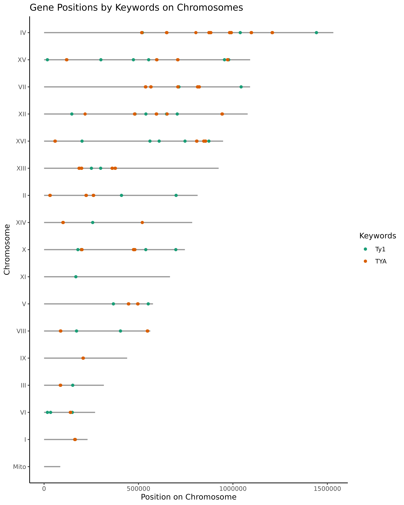

# :honeybee: chromR

[](https://www.r-project.org/about.html)


 :honeybee: `chromR` is an R script designed for visualizing gene or domain positions on chromosomes or contigs. It allows users to customize their plots using keywords, file-based inputs, and color options, making it ideal for genomic data exploration.

## :book: Features

### 📊 Visualization Option 

-  Plot genes, domains, or specific regions on chromosomes or contigs.
-  Highlight specific genes, regions, or domains using keyword filtering (`--keywords`).
- Additional plot types:
  - `--line_plot`: display features as lines instead of points.
  - `--accumulated_plot`: generate an accumulated gene count plot.

### 🎨 Color Customization 
- Define colors for categories using R color names (e.g., "black") or hex codes (e.g., #1f77b4).
- Support for RColorBrewer palettes via --palette

### 📁 Data Handling
- Accepts standard GFF (General Feature Format) files as input (`--gff_file`).
- Support for fill files (`--fill_file`) in CSV/TSV (`--formats`).
- Export processed data as tables in CSV or TSV formats (CSV/TSV with `--table`)

### 🔍 Filtering Option
- Strict mode (`--strict`) to show only chromosomes containing keywords
- High point support via layout file (`--layout`)
- Custom chromosome ordering (`--order_file`)
- Filter by number of chromosomes to display (`--number`)

### ⚙️ Integration & Compatibility
-  🚀 Command-Line Friendly. Run directly from the terminal or integrate into pipelines.
-  🖥️ RStudio Compatible. Easy to modify, debug, or execute within RStudio.

## :framed_picture: Example Output

- **Description**: This graph shows the position of two transposons in `Saccharomyces cerevisiae R64`, Ty1 (`Ty1`, `gene`) and TYA (`TYA`, `gene`) highlighted in green and orange.
- **Command used**:
```{bash, eval = FALSE}
Rscript chromR.R -g ../genome/Saccharomyces_cerevisiae.R64-1-1.114.gff3 --keywords Ty1 gene TYA gene
```
- **Genome example**: [Download Saccharomyces cerevisiae GFF](https://ftp.ensembl.org/pub/release-114/gff3/saccharomyces_cerevisiae/Saccharomyces_cerevisiae.R64-1-1.114.gff3.gz)



## 🧪 Installation

### 1. Clone this repository:

```{bash, eval = FALSE}
git clone https://github.com/mathiashole/chromR.git
cd chromR
```

### 2. Install required R packages:

Open R or RStudio and run:

```{r, eval = FALSE}
install.packages(c("dplyr", "readr", "ggplot2"))
```

## :wrench: Usage

### Requirements:

Ensure the following R packages are installed: `dplyr`, `readr`, `ggplot2`

### Execution Options:

#### 1. Using the Terminal
-  Navigate to the folder containing `chromR.R` and execute the script with the necessary arguments:

```{bash, eval = FALSE}
Rscript chromR.R --gff_file </path/to/file.gff> --keywords <keyword1> <keyword2> --colors <color1>
```

#### 2. Using RStudio

-  Open chromR.R in RStudio.
-  Set the arguments manually in the script or pass them interactively.

## :gear: Arguments

| Argument            | Description                               | Example                     |
|---------------------|-------------------------------------------|-----------------------------|
| `--gff_file` / `-g` | Path to the GFF file.                    | `--gff_file data.gff`       |
| `--keywords` / `-k` | Keywords to highlight specific features. | `--keywords gene1 CDS`      |
| `--colors` / `-c`   | Colors for keywords (names or hex).      | `--colors black orange`     |
| `--palette` / `-p`  | Select palette of RColorBrewer (names)   | `--palette Dark2`           |
| `--layout` / `-l`   | Optional layout input (e.g., ID file).   | `--layout data_ids.txt`     |
| `--accumulated_plot`/ `-ap`| Optional accumulated gene plot    | `--accumulated_plot`        |
| `--strict` / `-s`   | Only show chromosomes that contain any of the keywords | `--strict`               |
| `--line_plot` / `-lp`| Optional line plot gene.                | `--line_plot`               |
| `--order_file` / `-of` | File with custom chromosome order.    | `-of chrom_order.tsv`       |
| `--number` / `-n` | Maximum number of chromosomes to display.  | `-n 10 (Top 10 most longest)`       |
| `--fill_file` / `-ff` | File with regions to fill.             | `--fill_file regions.tsv`   |
| `--format` / `-f` | Fill and Order file format (csv/tsv)       | `--format tsv`              |
| `--table` / `-tab` | Export tables (csv/tsv).                  | `--table csv`               |

:bulb: Note: Colors must match the number of keywords provided. They can be standard R color names or hex codes. In the case of hexadecimal colors, they must be put in quotes (e.g. "#F4A582").

## :bulb: Bash Quick Examples

Example 1: Basic Plot

Highlight gene1 and CDS in orange:

```{bash, eval = FALSE}
Rscript chromR.R --gff_file data.gff --keywords gene1 CDS --colors orange
```

```{bash, eval = FALSE}
Rscript chromR.R -g </path/of/file.gff> -k <keyword1> <keyword1_asociated> <keyword2> <keyword2_asociated>
```

If you have any genome data, put this data in TSV or CSV format and use GFF to map the chromosome.

Example 2: Fill data to Plot

```{bash, eval = FALSE}
Rscript chromR.R --gff_file data.gff --fill_file data_to_fill_information.tsv/.csv --format tsv/csv
```

```{bash, eval = FALSE}
Rscript chromR.R -g </path/of/file.gff> -ff <path/of/data_to_fill> -f <tsv/csv>
```

## :bulb: R Quick Examples

Example 1: Basic Plot

Highlight gene1 and CDS in orange:

```{r, eval = FALSE}
args <- c("chromR.R", "--gff_file", "data.gff", "--keywords", "gene1 CDS", "--colors, "orange")

# Execution command
system2("Rscript", args = args)
```

If you have any genome data, put this data in TSV or CSV format and use GFF to map the chromosome.

Example 2: Fill data to Plot

```{r, eval = FALSE}
args <- c("chromR.R", "--gff_file", "data.gff", "--fill_file", "data_to_fill_information.tsv/.csv", "--format", "tsv/csv")

# Execution command
system2("Rscript", args = args)
```


## :sparkling_heart: Contributing

We welcome contributions!

- :octocat: [Pull requests](https://github.com/mathiashole/chromR/pulls) and :star2: stars are always welcome.
- For major changes, please open an [issue](https://github.com/mathiashole/chromR/issues) first to discuss what you would like to change.
- Please make sure to update tests as appropriate.

## :book: Roadmap

[](./ROADMAP.md)


## :mega: Contact

:bird: [Mathias](https://twitter.com/joaquinmangino)

## :scroll: License
MIT &copy; [Mathias Mangino](https://github.com/mathiashole)